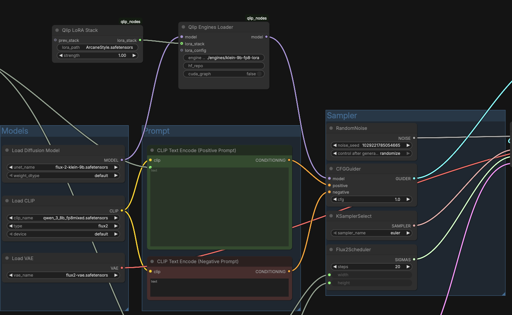

# ComfyUI-Qlip

GPU-accelerated inference for diffusion models in ComfyUI, powered by [Qlip](https://thestage.ai) from TheStage AI.

Qlip compiles transformer blocks into optimized engines, delivering significant speedups with full runtime LoRA support. Engines are compiled once and reused across all inference runs.

<p align="center">
  
  <br>
  <em>FLUX.2 Klein 9B with LoRA in ComfyUI. Just add the Qlip Engines Loader and Qlip LoRA Stack nodes to any existing workflow — works with any supported model and any sampler, as long as the compiled engines support the required input shapes.</em>
</p>

## Table of Contents

- [How It Works](#how-it-works)
- [Supported Models](#supported-models)
- [Benchmarks](#benchmarks)
- [Installation](#installation)
- [Precompiled Engines](#precompiled-engines)
- [Nodes](#nodes)
- [Workflows](#workflows)
- [LoRA Details](#lora-details)
- [Compiling New Models](#compiling-new-models)
- [Troubleshooting](#troubleshooting)

## How It Works

- **Compilation**: Compiles PyTorch transformer blocks into fused engines with optimized kernels
- **Dynamic FP8 Quantization**: On-the-fly FP8 quantization reduces memory ~2x while maintaining quality
- **Dynamic LoRA as Input Tensors**: LoRA weights are runtime inputs — hot-swap without recompilation
- **Weight Streaming**: Large models stream weights from CPU/disk, reducing GPU memory requirements
- **Dynamic Shapes**: Single compiled engine supports a range of input resolutions

## Supported Models

| Model | Architecture | Parameters | Type | Precompiled Engines |
|-------|-------------|------------|------|---------------------|
| [**FLUX.2 Klein**](https://huggingface.co/black-forest-labs/FLUX.2-klein-9B) | Dual-stream DiT | 9B | Image | [TheStageAI/Elastic-FLUX-2-Klein](https://huggingface.co/TheStageAI/Elastic-FLUX-2-Klein) |
| [**LTX-Video 2**](https://huggingface.co/Lightricks/LTX-2) (LTXAV) | Audio-Video DiT | 19B | Video | [TheStageAI/Elastic-LTX-2](https://huggingface.co/TheStageAI/Elastic-LTX-2) |
| [**Z-Image-Turbo**](https://huggingface.co/Comfy-Org/z_image_turbo) | NextDiT (Lumina2) | 6B | Image | [TheStageAI/Elastic-Z-Image-Turbo](https://huggingface.co/TheStageAI/Elastic-Z-Image-Turbo) |

More models coming soon — stay tuned for updates.

### Model Details

#### FLUX.2 Klein (9B)

Image generation model. Compiled with separate engines for **distilled** and **base** variants.

| Variant | CFG | Batch | Steps | Static Sizes | Dynamic Range |
|---------|-----|-------|-------|-------------|---------------|
| 9B **distilled** | 1.0 | 1 | 4 | 1024x1024, 1024x864 | 512px — 768px — 1024px |
| 9B **base** | 3.5 | 2 | 50 | 1024x1024, 1024x864 | 512px — 768px — 1024px |

Distilled and base models require separate engines (different batch sizes). Dynamic range supports any resolution from 512x512 to 1024x1024 (including non-square). Static profiles provide optimal performance at the listed sizes.

#### LTX-Video 2 (19B)

Audio-video generation model. Currently only the **distilled** variant is compiled (cfg=1.0, batch=1). Only **image-to-video (i2v)** workflow is supported.

| Variant | CFG | Batch | Workflow | Static Sizes (WxHxFrames) | Dynamic Range |
|---------|-----|-------|----------|--------------------------|---------------|
| 19B **distilled** | 1.0 | 1 | i2v | 768x512x41, 1280x720x121, 1408x896x121 | 512px—768px—1408px, 41—121 frames |

Video resolution and frame count are both dynamic. Audio tokens are computed automatically from the frame count.

#### Z-Image-Turbo

Image generation model. Compiled with cfg=1.0, batch=1, static sizes only.

| CFG | Batch | Static Sizes |
|-----|-------|-------------|
| 1.0 (turbo) | 1 | 1024x1024, 1024x768, 768x1024 |

> **Prompt length requirement.** The compiled engines expect the caption embedding to be padded to a fixed length (`cap_feats_len = 64` tokens). Z-Image-Turbo (Lumina2) pads `cap_feats` up to the next multiple of `pad_tokens_multiple = 32`, so:
> - prompts that yield ≤ 32 caption tokens → padded to **32** → fails with `Invalid input shape: no matching optimization profile`
> - prompts that yield 33–64 caption tokens → padded to **64** → matches the engine ✓
>
> Always use **a sufficiently long prompt** (roughly **a full sentence with 20+ words**, or any prompt that produces > 32 tokens after the Qwen tokenizer). Short prompts like `"a cat"` will not work.
>
> Example of a good prompt:
> ```
> "Pixel art style. Latina female with thick wavy hair, harbor boats and pastel houses behind. Breezy seaside light, warm tones, cinematic close-up."
> ```

## Benchmarks

All measurements: single image/video generation, batch size 1, H100, torch 2.8.0, **warm run** (second run, engines already loaded). Current precompiled engines include LoRA support, which adds minor overhead (~5-15%) compared to non-LoRA engines. Non-LoRA engines with faster inference will be available in a future release.

### Image Generation (1024x1024, 20 steps for flux, 8 steps for z-image, cfg=1)

| Model | Method | Time (s) | Speedup |
|-------|--------|----------|---------|
| **FLUX.2 Klein 9B** | Eager (PyTorch) | 3.743 | 1.0x |
| | torch.compile ([KJNodes](https://github.com/kijai/ComfyUI-KJNodes)) | 3.064 | 1.22x |
| | **Qlip BF16 + LoRA** | 2.944 | 1.27x |
| | **Qlip FP8 + LoRA** | 2.215 | **1.69x** |
| **Z-Image-Turbo** | Eager (PyTorch) | 1.436 | 1.0x |
| | torch.compile ([KJNodes](https://github.com/kijai/ComfyUI-KJNodes)) | 0.999 | 1.44x |
| | [SGLDiffusion](https://github.com/sgl-project/sglang/tree/main/python/sglang/multimodal_gen/apps/ComfyUI_SGLDiffusion) | 0.920 | 1.56x |
| | **Qlip BF16 + LoRA** | 0.957 | 1.50x |
| | **Qlip FP8 + LoRA** | 0.773 | **1.86x** |

### Video Generation (LTX-Video 2, 1280x720, 121 frames, 8 basic sampler steps + 3 upsampling steps)

| Method | Time (s) | Speedup |
|--------|----------|---------|
| Eager (PyTorch) | 7.829 | 1.0x |
| torch.compile ([KJNodes](https://github.com/kijai/ComfyUI-KJNodes)) | 5.330 | 1.47x |
| **Qlip BF16 + LoRA** | 6.020 | 1.30x |
| **Qlip FP8 + LoRA** | 5.051 | **1.55x** |

> All benchmarked engines include runtime LoRA support. LoRA adds ~5-15% overhead due to additional MatMul operations per layer. Faster non-LoRA engines will be available in a future update.
>
> More GPUs (B200, L40S, RTX 5090) coming soon.

## Installation

### Prerequisites

- Python 3.10+
- NVIDIA GPU with CUDA 12.x (Hopper, Blackwell, Ada Lovelace)
- ComfyUI installed and working (see below if starting from scratch)

### Step 1: Install ComfyUI-Qlip nodes

**From scratch** (no ComfyUI yet):
```bash
git clone https://github.com/comfyanonymous/ComfyUI.git
cd ComfyUI
git checkout 048dd2f3
python3 -m venv venv
source venv/bin/activate
pip install --upgrade pip
pip install -r requirements.txt
cd custom_nodes
git clone https://github.com/TheStageAI/ComfyUI-Qlip
cd ..
```

**Existing ComfyUI** — activate your venv and clone:
```bash
source /path/to/ComfyUI/venv/bin/activate
cd /path/to/ComfyUI/custom_nodes
git clone https://github.com/TheStageAI/ComfyUI-Qlip
```

> If ComfyUI-Qlip is published to the Comfy Registry, you can also install via `comfy node install comfyui-qlip`.

### Step 2: Install Qlip dependencies

From the ComfyUI-Qlip directory (with the same venv activated):

```bash
pip install -r custom_nodes/ComfyUI-Qlip/requirements.txt
```

This installs `qlip.core[nvidia]` from the TheStage AI package registry.

### Step 3: Setup TheStage API token

Get your token at [app.thestage.ai](https://app.thestage.ai). Required for Qlip engine access.

```bash
pip install thestage
thestage config set --access-token <YOUR_API_TOKEN>
```

### (Optional) Download models

If you don't have the required models yet, use the download scripts from [`scripts/`](scripts/):

```bash
export COMFYUI_PATH=/path/to/ComfyUI
bash custom_nodes/ComfyUI-Qlip/scripts/download_z_image_turbo_models.sh
bash custom_nodes/ComfyUI-Qlip/scripts/download_ltx_2_models.sh
bash custom_nodes/ComfyUI-Qlip/scripts/download_flux_klein_models.sh
```

FLUX.2 Klein is a gated model — requires `huggingface-cli login` and license acceptance. HuggingFace cache defaults to `/workspace/cache` (override with `HF_HUB_CACHE`). Scripts skip already-downloaded files.

### Step 4: Launch ComfyUI

```bash
python main.py --listen 0.0.0.0 --port 8188
```

> Always activate the same venv before launching: `source venv/bin/activate`

### (Optional) Additional custom nodes for benchmarking

```bash
cd /path/to/ComfyUI/custom_nodes

# KJNodes — provides torch.compile node for comparison benchmarks
git clone https://github.com/kijai/ComfyUI-KJNodes

# SGLDiffusion — SGLang-based acceleration (Z-Image-Turbo, FLUX Klein)
git clone https://github.com/sgl-project/ComfyUI_SGLDiffusion
pip install "sglang[diffusion]"
```

### 6. (Optional) Flash Attention for Hopper GPUs

```bash
pip install flash-attn --no-build-isolation
```

## Precompiled Engines

Precompiled engines are hosted on HuggingFace. The **Qlip Engines Loader** node can download them automatically — just set the `hf_repo` input:

| Model | `hf_repo` value |
|-------|----------------|
| FLUX.2 Klein 9B Distilled BF16 + LoRA | `TheStageAI/Elastic-FLUX-2-Klein:models/H100/klein-9b_lora` |
| FLUX.2 Klein 9B Distilled FP8 + LoRA | `TheStageAI/Elastic-FLUX-2-Klein:models/H100/klein-9b-fp8_lora` |
| FLUX.2 Klein 9B Base BF16 + LoRA | `TheStageAI/Elastic-FLUX-2-Klein:models/H100/klein-base-9b_lora` |
| FLUX.2 Klein 9B Base FP8 + LoRA | `TheStageAI/Elastic-FLUX-2-Klein:models/H100/klein-base-9b-fp8_lora` |
| LTX-2 19B Distilled BF16 + LoRA | `TheStageAI/Elastic-LTX-2:models/H100/ltx-2-19b-distilled_lora` |
| LTX-2 19B Distilled FP8 + LoRA | `TheStageAI/Elastic-LTX-2:models/H100/ltx-2-19b-distilled-fp8_lora` |
| Z-Image-Turbo BF16 + LoRA | `TheStageAI/Elastic-Z-Image-Turbo:models/H100/z-image-turbo_lora` |
| Z-Image-Turbo FP8 + LoRA | `TheStageAI/Elastic-Z-Image-Turbo:models/H100/z-image-turbo-fp8_lora` |

The format is `org/repo:path/to/engines`. Engines are downloaded once and cached.

Alternatively, download manually with `huggingface-cli`:

```bash
# Example: FLUX.2 Klein 9B FP8 + LoRA
huggingface-cli download TheStageAI/Elastic-FLUX-2-Klein \
    --local-dir ./engines/flux-klein \
    --include "models/H100/klein-9b-fp8_lora/*"
```

Then point `engines_path` to the downloaded directory.

## Nodes

### Qlip Engines Loader

Loads pre-compiled engines and replaces transformer blocks at runtime. Caches engines across runs — first load takes a few seconds, subsequent runs are instant.

| Input | Type | Required | Default | Description |
|-------|------|----------|---------|-------------|
| `model` | MODEL | Yes | | Model from any loader (UNETLoader, CheckpointLoaderSimple, etc.) |
| `engines_path` | STRING | No | `""` | Path to directory with `.qlip`/`.engine` files |
| `hf_repo` | STRING | No | `""` | HuggingFace repo with engines, e.g. `TheStageAI/Elastic-FLUX-2-Klein:models/H100/klein-9b-fp8_lora` |
| `lora_stack` | QLIP_LORA_STACK | No | | LoRA stack from `Qlip LoRA Stack` node(s) |
| `cuda_graph` | BOOLEAN | No | `False` | Enable CUDA Graph capture — reduces kernel launch overhead for faster inference |

LoRA is auto-detected: if `lora_config.json` exists in the engines directory or a `lora_stack` is connected, LoRA support is enabled automatically. No manual toggle needed.

**Output:** `MODEL`

### Qlip LoRA Stack

Builds a chainable list of LoRA entries. Each node adds one LoRA file. Chain multiple nodes via `prev_stack` to stack LoRAs.

| Input | Type | Required | Default | Description |
|-------|------|----------|---------|-------------|
| `lora_path` | STRING | Yes | `""` | Path to LoRA `.safetensors` file |
| `strength` | FLOAT | Yes | `1.0` | Strength multiplier (`-10.0` to `10.0`) |
| `prev_stack` | QLIP_LORA_STACK | No | | Previous stack to extend |

**Output:** `QLIP_LORA_STACK`

### Qlip LoRA Switch

Enables or disables LoRA at runtime without reloading engines. Use after `Qlip Engines Loader` with LoRA-enabled engines.

| Input | Type | Required | Default | Description |
|-------|------|----------|---------|-------------|
| `model` | MODEL | Yes | | Model with loaded engines |
| `enable` | BOOLEAN | Yes | `True` | Enable or disable LoRA |
| `lora_stack` | QLIP_LORA_STACK | No | | LoRA stack to load (when enabling) |

**Output:** `MODEL`

### Qlip Timer Start

Records a start timestamp. Place **before** the node(s) you want to measure.

| Input | Type | Required | Default | Description |
|-------|------|----------|---------|-------------|
| `passthrough` | * | Yes | | Any data — passed through unchanged |
| `timer_name` | STRING | Yes | `"timer_1"` | Name for this timer (must match Timer Stop) |
| `cuda_sync` | BOOLEAN | No | `True` | Call `torch.cuda.synchronize()` for accurate GPU timing |

**Output:** same data as `passthrough`

### Qlip Timer Stop

Records elapsed time since the matching Timer Start and displays it. Place **after** the measured node(s).

| Input | Type | Required | Default | Description |
|-------|------|----------|---------|-------------|
| `passthrough` | * | Yes | | Any data — passed through unchanged |
| `timer_name` | STRING | Yes | `"timer_1"` | Name for this timer (must match Timer Start) |
| `cuda_sync` | BOOLEAN | No | `True` | Call `torch.cuda.synchronize()` for accurate GPU timing |

**Output:** same data as `passthrough`. Elapsed time is shown in the node UI and printed to console.

### Qlip Timer Report

Displays a summary table of all timer measurements. Connect the `trigger` input to any node output that executes after all Timer Stop nodes.

| Input | Type | Required | Default | Description |
|-------|------|----------|---------|-------------|
| `trigger` | * | No | | Connect any output to ensure execution order |
| `track_cold_start` | BOOLEAN | No | `False` | Show cold start (first run) comparison — displays delta % vs first measurement |

**Output:** none (display only). Results are shown in the node UI and printed to console.

Results auto-reset between workflow runs. Cold start values persist across runs for comparison.

## Workflows

Ready-to-use ComfyUI workflow files are in [`workflows/`](workflows/):

| File | Description |
|------|-------------|
| `Flux-Klein.json` | FLUX.2 Klein image generation workflow |
| `video_ltx2_i2v_distilled.json` | LTX-2 image-to-video workflow |
| `z-image-turbo.json` | Z-Image-Turbo image generation workflow |

Model download scripts are in [`scripts/`](scripts/):

| Script | Description |
|--------|-------------|
| `download_flux_klein_models.sh` | Downloads FLUX.2 Klein models (diffusion model, text encoder, VAE). Requires HF token (gated model) |
| `download_ltx_2_models.sh` | Downloads LTX-2 models (checkpoints, text encoder, LoRAs, upscaler) |
| `download_z_image_turbo_models.sh` | Downloads Z-Image-Turbo models (diffusion model, text encoder, VAE, LoRA) |

To download models for a specific workflow:

```bash
export COMFYUI_PATH=/path/to/ComfyUI
bash custom_nodes/ComfyUI-Qlip/scripts/download_flux_klein_models.sh
bash custom_nodes/ComfyUI-Qlip/scripts/download_ltx_2_models.sh
bash custom_nodes/ComfyUI-Qlip/scripts/download_z_image_turbo_models.sh
```

Scripts skip already-downloaded files, so they are safe to re-run. HuggingFace cache defaults to `/workspace/cache` — override with `HF_HUB_CACHE`.

### Basic (no LoRA)

```
UNETLoader / CheckpointLoaderSimple (model.safetensors)
  -> Qlip Engines Loader (engines_path=...)
    -> BasicGuider / CFGGuider
      -> SamplerCustomAdvanced
        -> VAEDecode -> SaveImage
```

### With LoRA

```
Qlip LoRA Stack (lora.safetensors, strength=1.0)  ─────────────────────┐
                                                                         |
UNETLoader / CheckpointLoaderSimple (model.safetensors)                  |
  -> Qlip Engines Loader (engines_path=..., lora_stack=^)
    -> BasicGuider / CFGGuider
      -> SamplerCustomAdvanced
        -> VAEDecode -> SaveImage
```

LoRA support is auto-detected from `lora_config.json` in the engines directory. No manual toggle needed.

### Multi-LoRA stacking

```
Qlip LoRA Stack (style_lora.safetensors, 0.8)
  -> Qlip LoRA Stack (detail_lora.safetensors, 0.5, prev_stack=^)
    -> Qlip Engines Loader (engines_path=..., lora_stack=^)
```

Multiple LoRAs are stacked — their ranks concatenate. Total rank must fit within `--max-lora-rank` used at compilation time.

## LoRA Details

LoRA weights are **runtime inputs** to compiled engines, not baked into weights. The `lora_packed` tensor shape `[num_layers, rank, max_features, 2]` holds A and B matrices. The rank dimension is dynamic, allowing different LoRA files without recompilation.

**Caching behavior:**
- Engines loaded once per path, reused across runs
- LoRA weights hot-swapped in-place when stack changes
- Same LoRA between runs — weights already loaded, swap skipped
- LoRA removed — packed tensors zeroed, no engine reload

**Constraints:**
- Engines compiled without `--lora` cannot accept LoRA at runtime
- Engines compiled with `--lora` work both with and without LoRA (auto-detected via `lora_config.json`)
- LyCORIS / LoKR format is not supported

## Compiling New Models

You can compile any ComfyUI-compatible model into Qlip engines. This is useful when:
- You want to accelerate a model not in the precompiled engines list
- You need engines for a specific GPU (engines are hardware-specific)
- You want custom resolution ranges or LoRA support

### Using Claude Code (recommended)

The easiest way to add a new model is with [Claude Code](https://claude.ai/claude-code). This repository includes an [agent skill](skills/qlip-model-compiler/SKILL.md) that knows how to write compilation scripts, handle model-specific patches, and run compilation.

**What to provide:**

1. **ComfyUI workflow JSON** — export from ComfyUI. **Important**: expand all subgraphs/groups before exporting so every node is visible in the JSON file
2. **Path to ComfyUI** installation (so the agent can read model source code)
3. **Model path** and **LoRA path** (if needed)
4. **Target GPU** and **target resolutions**
5. **Server SSH access** (if compiling remotely)

**Example prompt:**
```
I want to compile my model with Qlip.

Workflow: /path/to/my_workflow.json
ComfyUI: /path/to/ComfyUI
Model: my_model.safetensors (UNETLoader, in models/diffusion_models/)
LoRA: my_lora.safetensors (in models/loras/)
Text encoder: my_encoder.safetensors (CLIPLoader)
VAE: my_vae.safetensors
Target: H100, 512-1024px, FP8 quantization, LoRA support
```

Claude will analyze the workflow and model source code, write download/compile/benchmark scripts, run compilation, and add inference support to the nodes if needed.

### Manual Compilation

If you prefer to write scripts manually, see the [compilation skill reference](skills/qlip-model-compiler/SKILL.md) for the full API reference including imports, function signatures, patching patterns, and bash wrapper templates.

## Troubleshooting

| Problem | Solution |
|---------|----------|
| Shape mismatch errors | Ensure engines match the model (LoRA-enabled engines need `lora_config.json` in the engines directory) |
| Slow first run | Normal — engine loading takes a few seconds on first use |
| Engines don't work after GPU change | Engines are GPU-specific — recompile after changing hardware |
| FP8 quality looks bad | Try `--unfuse-qkv` and `--skip-first-blocks 1 --skip-last-blocks 1` |
| LoRA not taking effect | Check that `lora_config.json` exists in engines directory and LoRA rank ≤ max compiled rank |
| `flash_attn 3 package is not installed` | Install with `pip install flash-attn --no-build-isolation` (optional, Hopper only) |

## License

Proprietary. Powered by [TheStage AI](https://thestage.ai).
